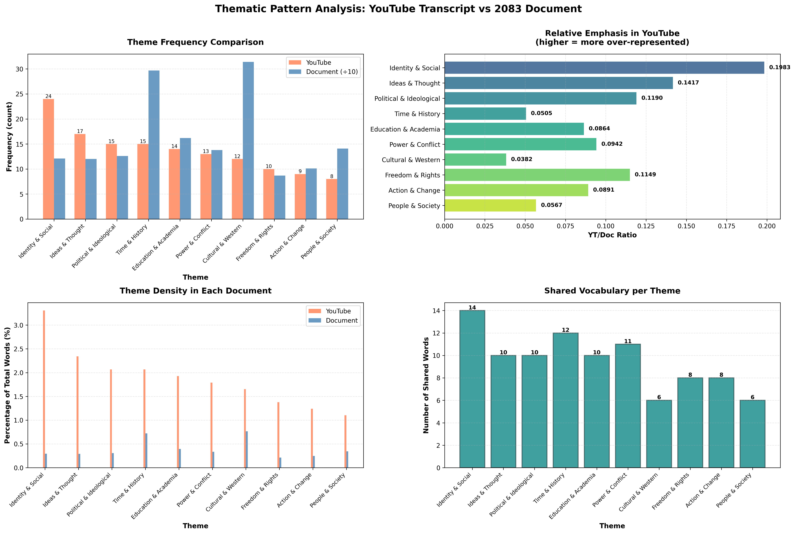

# NLP Document Similarity Analysis
## Comparing YouTube Transcript with 2083 Document

Comprehensive NLP analysis comparing a YouTube video transcript (Jordan Peterson - Postmodernism) with a 1000+ page document using multiple similarity methods.

## Documents

- **2083. EUROPEAN DECLARATION OF INDEPENDENCE.txt** - 292KB, ~41,000 tokens, 1000+ pages
- **youtube_transcript_clean.txt** - YouTube video transcript, 726 words
- **youtube_transcript_before_hobbes.txt** - Truncated transcript (first 345 words)
- **2083_first_half.txt** - First half of 2083 document (~20,774 words)
- **2083_second_half.txt** - Second half of 2083 document (~20,774 words)
- **youtube_first_half.txt** - First half of YT transcript (363 words)
- **youtube_second_half.txt** - Second half of YT transcript (363 words)

## Analysis Scripts

### Basic Similarity Measures
- `bag_of_words_score.py` - Simple bag-of-words cosine similarity
- `bag_of_words_no_stopwords.py` - Bag-of-words without stop words
- `tfidf_score.py` - TF-IDF based cosine similarity (custom implementation)
- `vector_similarity.py` - Professional TF-IDF using scikit-learn
- `ngram_score.py` - N-gram based similarity (bigrams and trigrams)

### Advanced Analysis
- `chunk_analysis.py` - Compare document chunks (~250 pages each) to transcript
- `chunk2_deep_analysis.py` - Detailed analysis of best-matching chunk
- `phrase_matching.py` - Find exact phrase matches and named entities
- `shared_words_list.py` - Extract all shared vocabulary
- `truncated_analysis.py` - Compare full vs truncated transcript
- `split_document_analysis.py` - Split both documents in half and compare all combinations
- `thematic_analysis.py` - Group shared words into themes and analyze patterns

### Presentation
- `analysis_presentation.ipynb` - Jupyter notebook with visualizations
- `visualize_themes.py` - Generate 4-panel thematic analysis visualization

## Key Findings

### Similarity Scores Summary

| Method | Similarity Score |
|--------|------------------|
| Bag-of-Words (with stop words) | 91.05% |
| Bag-of-Words (no stop words) | 28.16% |
| Bigrams | 31.14% |
| Trigrams | 0.93% |
| **TF-IDF (sklearn) - Most Accurate** | **16.01%** |
| TF-IDF with N-grams | 15.31% |

### Shared Vocabulary Word Cloud


*242 shared words (stop words removed), sized by frequency in YouTube transcript*

### Thematic Pattern Analysis



*Comprehensive 4-panel visualization showing theme frequencies, YT/Doc ratios, theme density, and shared vocabulary counts across 10 thematic clusters*

### Main Conclusions

1. **True Similarity: ~16%**
   - Initial bag-of-words score of 91% was inflated by common stop words
   - Removing stop words drops similarity to 28%
   - Professional TF-IDF analysis shows realistic 16% similarity

2. **Minimal Direct Quotation**
   - Only 2 exact phrase matches of 4+ words found
   - Less than 1% trigram overlap
   - Phrase "dead white males" appears in both (same context: Shakespeare/curriculum)
   - Documents are thematically related but not directly quoting

3. **Vocabulary Analysis**
   - 72% of YouTube vocabulary (242/336 words) appears in document
   - 177 terms unique to second half of video (after "Hobbes")
   - Shared terms: ideas, identity, western, world, post, campus, universities, sexual, power, marx

4. **Thematic Pattern Analysis**
   - **Identity & Social** - Most prominent theme in YouTube (24 occurrences)
     - Words: identity, race, sex, sexual, gender, diversity, equality, oppression, class
     - Highest YT/Doc ratio (0.1983x) - most over-represented in YouTube
   - **Ideas & Thought** - Second highest (17 occurrences)
     - Words: ideas, think, philosophy, truth, belief, concepts
   - **Political & Ideological** - Third major theme (15 occurrences)
     - Words: marx, capitalism, radical, progressive, politics, post, postmodernism
   - **Education & Academia** - 14 occurrences
     - Words: campus, university, professor, college, degree
   - All 7 thematic clusters show consistent vocabulary overlap

5. **Different Terminology for Same Concepts**
   - **Document uses:** "Political Correctness" (78x), "Cultural Marxism" (28x), "Frankfurt School" (72x)
   - **YouTube uses:** "Post Modernist" (3x), "Western Civilization" (1x)
   - Both discuss related concepts with different framing

6. **Different Focus Areas**
   - **Document:** Heavy focus on Islam (186 mentions), extensive geographic/political content
   - **YouTube:** Focus on education, post-modernism, no Islam mentions
   - YouTube synthesizes themes from across entire document, not one section

7. **Chunk Analysis Results**
   - Document split into 4 chunks (~250 pages each)
   - Chunk 2 highest similarity: 13.18%
   - **Whole document (16.01%) more similar than any chunk**
   - Suggests video draws from multiple sections, not concentrated in one area

8. **Named Entity Analysis**
   - Common names: Marx, Karl Marx, Shakespeare, America, West
   - Document-only: Frankfurt School, Islam, Muhammad, Political Correctness
   - YouTube mentions: Jordan Peterson (video creator)

9. **Truncated Analysis (Before "Hobbes")**
   - First half (345 words): 12.19% similarity
   - Full transcript (726 words): 16.01% similarity
   - Second half contributes more to similarity
   - Terms after Hobbes: capitalism, power, politics, conflict, free, poor

10. **Split Document Analysis (Halves Comparison)**
   - **2083 First Half vs YT Full: 13.96%** (MORE similar)
   - **2083 Second Half vs YT Full: 11.45%** (LESS similar)
   - Difference: 2.51 percentage points
   - **Critical finding:** First ~500 pages of 2083 document more closely match YouTube video content
   - YT First Half vs 2083 Full: 12.67% (slightly higher than second half at 11.91%)
   - Best overall match: Full documents (16.01%)

### Exact Phrase Matches

**5-word match:**
- "for the first time in"

**3-word matches:**
- "throughout the west"
- "dead white males" (contextually significant)
- "of the west"
- "freedom of speech"
- "the soviet union"

## Generated Output Files

- `shared_words_by_yt_frequency.txt` - All 242 shared words sorted by YT importance
- `shared_words_by_doc_frequency.txt` - Sorted by document frequency
- `shared_words_alphabetical.txt` - Simple alphabetical list
- `shared_words_summary.txt` - Overview with statistics
- `split_analysis_results.txt` - All 9 combinations of split document comparisons
- `thematic_analysis_results.txt` - Thematic clustering of shared vocabulary

## Usage

### Run individual analyses:
```bash
python3 bag_of_words_score.py
python3 vector_similarity.py
python3 ngram_score.py
python3 chunk_analysis.py
python3 phrase_matching.py
python3 shared_words_list.py
python3 thematic_analysis.py
```

### With virtual environment (for sklearn-based scripts):
```bash
source venv/bin/activate
python vector_similarity.py
python chunk_analysis.py
python chunk2_deep_analysis.py
python truncated_analysis.py
python visualize_themes.py
```

### Jupyter notebook:
```bash
source venv/bin/activate
jupyter notebook analysis_presentation.ipynb
```

## Requirements

### Standard library scripts:
- Python 3
- Standard library only (re, collections, math)

### Advanced analysis:
- scikit-learn
- pandas
- matplotlib
- jupyter
- numpy

Install with:
```bash
pip install scikit-learn pandas matplotlib jupyter numpy
```

## Interpretation

The analysis provides quantitative measures of textual similarity between the YouTube transcript and document:

### Observed Similarities:
- **Semantic similarity:** 16.01% (TF-IDF)
- **Vocabulary overlap:** 72% of YouTube terms appear in document (242/336 words)
- **Shared vocabulary:** ideas, identity, western, world, post, campus, universities, sexual, power, marx, shakespeare
- **Common phrase:** "dead white males" in similar context (Shakespeare/curriculum)
- **Thematic overlap:** Western culture, education, progressive ideology, identity politics, cultural criticism

### Observed Differences:
- **Terminology variation:** Document uses "Political Correctness" (78x), "Cultural Marxism" (28x), "Frankfurt School" (72x); YouTube uses "Post Modernist" (3x)
- **Scope:** Document is encyclopedic (1000+ pages, multiple topics including Islam 186x); video is focused (education/culture, no Islam mentions)
- **Direct quotation:** Only 2 exact phrase matches of 4+ words; <1% trigram overlap
- **Distribution:** Whole document (16%) more similar than any single chunk (8-13%), suggesting themes span entire text

### Key Metrics:
- Bag-of-words: 91% (inflated by stop words) → 28% (stop words removed) → 16% (TF-IDF weighted)
- Phrase-level: 31% (bigrams) → 0.93% (trigrams)
- Vocabulary: 72% overlap but different frequency distributions

The 16% TF-IDF similarity score indicates moderate lexical and thematic overlap with limited exact phrase matching.
