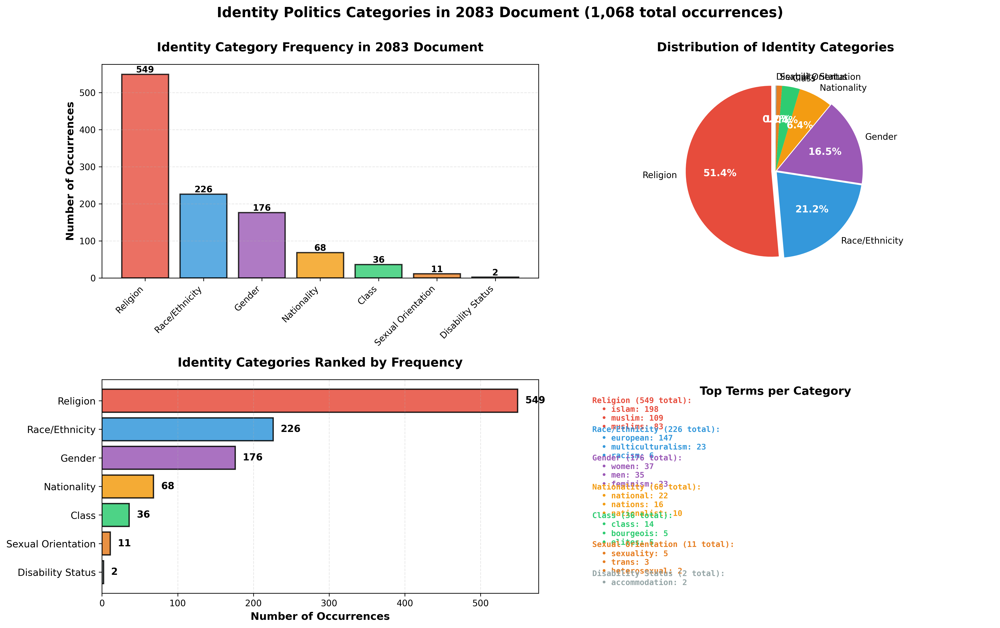
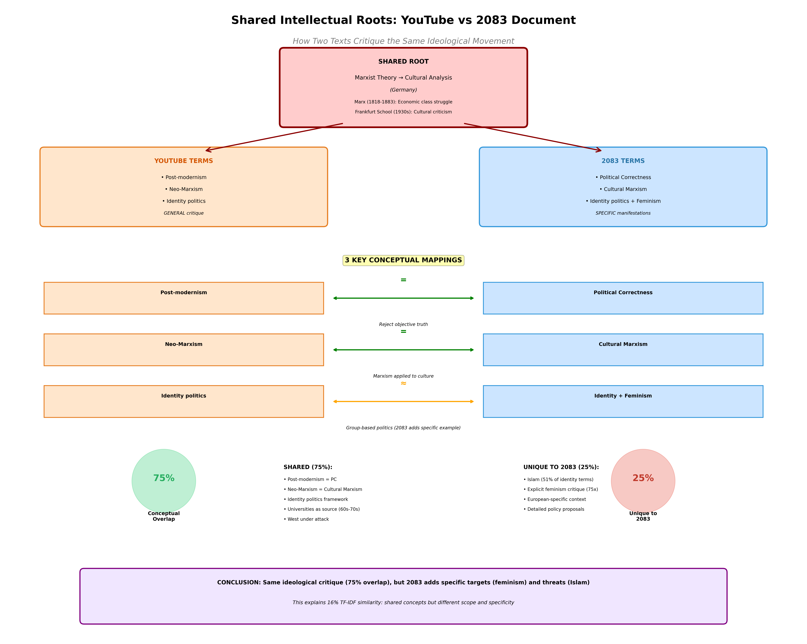
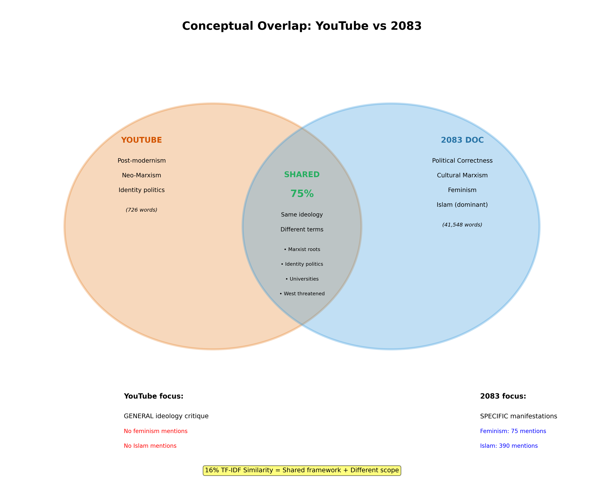
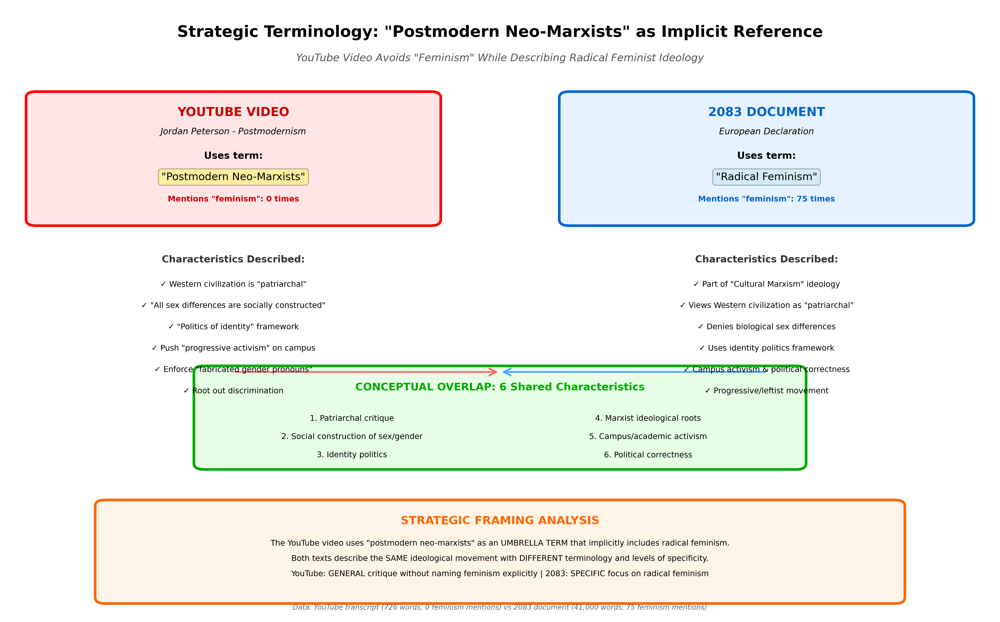

# NLP Document Similarity Analysis
## Comparing YouTube Transcript with 2083 Document

Comprehensive NLP analysis comparing a YouTube video transcript (Jordan Peterson - Postmodernism) with a 1000+ page document using multiple similarity methods.

## Documents

- **2083. EUROPEAN DECLARATION OF INDEPENDENCE.txt** - 292KB, ~41,000 tokens, 1000+ pages
- **youtube_transcript_clean.txt** - YouTube video transcript, 726 words
- **youtube_transcript_before_hobbes.txt** - Truncated transcript (first 345 words)
- **2083_first_half.txt** - First half of 2083 document (~20,774 words)
- **2083_second_half.txt** - Second half of 2083 document (~20,774 words)
- **youtube_first_half.txt** - First half of YT transcript (363 words)
- **youtube_second_half.txt** - Second half of YT transcript (363 words)

## Analysis Scripts

### Basic Similarity Measures
- `bag_of_words_score.py` - Simple bag-of-words cosine similarity
- `bag_of_words_no_stopwords.py` - Bag-of-words without stop words
- `tfidf_score.py` - TF-IDF based cosine similarity (custom implementation)
- `vector_similarity.py` - Professional TF-IDF using scikit-learn
- `ngram_score.py` - N-gram based similarity (bigrams and trigrams)

### Advanced Analysis
- `chunk_analysis.py` - Compare document chunks (~250 pages each) to transcript
- `chunk2_deep_analysis.py` - Detailed analysis of best-matching chunk
- `phrase_matching.py` - Find exact phrase matches and named entities
- `shared_words_list.py` - Extract all shared vocabulary
- `truncated_analysis.py` - Compare full vs truncated transcript
- `split_document_analysis.py` - Split both documents in half and compare all combinations
- `thematic_analysis.py` - Group shared words into themes and analyze patterns

### Content Analysis
- `identity_categories_analysis.py` - Search for 7 identity politics categories
- `visualize_identity_categories.py` - Visualize identity category distribution
- `religion_context_analysis.py` - Analyze how religion is mentioned
- `religion_halves_comparison.py` - Compare religion mentions in first vs second half
- `feminism_analysis.py` - Comprehensive feminism discourse analysis
- `thematic_similarities_analysis.py` - Analyze conceptual overlaps and map YouTube↔2083 terms
- `feminism_comparison_yt_vs_doc.py` - Compare feminism mentions between YouTube and 2083
- `visualize_shared_roots.py` - Create visualizations showing shared intellectual framework
- `feminism_implicit_reference_analysis.py` - Analyze if YT refers to feminists as postmodern neo-marxists
- `visualize_implicit_feminism.py` - Visualize strategic terminology and implicit reference

### Presentation
- `analysis_presentation.ipynb` - Jupyter notebook with visualizations
- `visualize_themes.py` - Generate 4-panel thematic analysis visualization

## Key Findings

### Similarity Scores Summary

| Method | Similarity Score |
|--------|------------------|
| Bag-of-Words (with stop words) | 91.05% |
| Bag-of-Words (no stop words) | 28.16% |
| Bigrams | 31.14% |
| Trigrams | 0.93% |
| **TF-IDF (sklearn) - Most Accurate** | **16.01%** |
| TF-IDF with N-grams | 15.31% |

### Shared Vocabulary Word Cloud


*242 shared words (stop words removed), sized by frequency in YouTube transcript*

### Thematic Pattern Analysis


*Comprehensive 4-panel visualization showing theme frequencies, YT/Doc ratios, theme density, and shared vocabulary counts across 10 thematic clusters*

### Main Conclusions

1. **True Similarity: ~16%**
   - Initial bag-of-words score of 91% was inflated by common stop words
   - Removing stop words drops similarity to 28%
   - Professional TF-IDF analysis shows realistic 16% similarity

2. **Minimal Direct Quotation**
   - Only 2 exact phrase matches of 4+ words found
   - Less than 1% trigram overlap
   - Phrase "dead white males" appears in both (same context: Shakespeare/curriculum)
   - Documents are thematically related but not directly quoting

3. **Vocabulary Analysis**
   - 72% of YouTube vocabulary (242/336 words) appears in document
   - 177 terms unique to second half of video (after "Hobbes")
   - Shared terms: ideas, identity, western, world, post, campus, universities, sexual, power, marx

4. **Thematic Pattern Analysis**
   - **Identity & Social** - Most prominent theme in YouTube (24 occurrences)
     - Words: identity, race, sex, sexual, gender, diversity, equality, oppression, class
     - Highest YT/Doc ratio (0.1983x) - most over-represented in YouTube
   - **Ideas & Thought** - Second highest (17 occurrences)
     - Words: ideas, think, philosophy, truth, belief, concepts
   - **Political & Ideological** - Third major theme (15 occurrences)
     - Words: marx, capitalism, radical, progressive, politics, post, postmodernism
   - **Education & Academia** - 14 occurrences
     - Words: campus, university, professor, college, degree
   - All 7 thematic clusters show consistent vocabulary overlap

5. **Different Terminology for Same Concepts**
   - **Document uses:** "Political Correctness" (78x), "Cultural Marxism" (28x), "Frankfurt School" (72x)
   - **YouTube uses:** "Post Modernist" (3x), "Western Civilization" (1x)
   - Both discuss related concepts with different framing

6. **Different Focus Areas**
   - **Document:** Heavy focus on Islam (186 mentions), extensive geographic/political content
   - **YouTube:** Focus on education, post-modernism, no Islam mentions
   - YouTube synthesizes themes from across entire document, not one section

7. **Chunk Analysis Results**
   - Document split into 4 chunks (~250 pages each)
   - Chunk 2 highest similarity: 13.18%
   - **Whole document (16.01%) more similar than any chunk**
   - Suggests video draws from multiple sections, not concentrated in one area

8. **Named Entity Analysis**
   - Common names: Marx, Karl Marx, Shakespeare, America, West
   - Document-only: Frankfurt School, Islam, Muhammad, Political Correctness
   - YouTube mentions: Jordan Peterson (video creator)

9. **Truncated Analysis (Before "Hobbes")**
   - First half (345 words): 12.19% similarity
   - Full transcript (726 words): 16.01% similarity
   - Second half contributes more to similarity
   - Terms after Hobbes: capitalism, power, politics, conflict, free, poor

10. **Split Document Analysis (Halves Comparison)**
   - **2083 First Half vs YT Full: 13.96%** (MORE similar)
   - **2083 Second Half vs YT Full: 11.45%** (LESS similar)
   - Difference: 2.51 percentage points
   - **Critical finding:** First ~500 pages of 2083 document more closely match YouTube video content
   - YT First Half vs 2083 Full: 12.67% (slightly higher than second half at 11.91%)
   - Best overall match: Full documents (16.01%)

## Content Analysis of 2083 Document

### Identity Politics Categories (1,068 total occurrences)

All 7 identity categories are present with dramatically uneven distribution:



| Category | Count | Percentage | Status |
|----------|-------|------------|--------|
| **Religion** | 549 | 51.4% | ✓ DOMINANT |
| **Race/Ethnicity** | 226 | 21.2% | ✓ PRESENT |
| **Gender** | 176 | 16.5% | ✓ PRESENT |
| **Nationality** | 68 | 6.4% | ✓ PRESENT |
| **Class** | 36 | 3.4% | ✓ PRESENT |
| **Sexual Orientation** | 11 | 1.0% | ✓ MINIMAL |
| **Disability Status** | 2 | 0.2% | ✓ MINIMAL |

**Key Terms:**
- Religion: islam (198), muslim (109), muslims (83), christian (34)
- Race/Ethnicity: european (147), multiculturalism (23)
- Gender: women (37), men (35), feminism (23)

**Finding:** Document frames identity primarily through **religious and ethno-cultural lenses** (72.6% of identity terms) rather than gender/sexuality frameworks common in Western identity politics discourse.

### Religion Discourse Analysis

**Frequency Overview:**
- Islam: 198 occurrences (71% of religious terms)
- Muslim/Muslims: 192 occurrences
- Christianity: 72 occurrences (Christian + Christianity + Christians)
- **Islam mentioned 5.4x more than Christianity**

**Framing Patterns:**
- 56 Islam contexts contain conflict/negative framing (war, terror, threat)
- 16 Islam contexts contain positive framing (peace)
- Common collocations with Islam: war (17), against (14), terror (8), threat (4)
- Key phrases: "islam war" (35 matches), "islam europe" (29 matches)

**Islam Context Examples:**
- "islam's war against the world"
- "european negationism regarding the terrible record of islam"
- "rewriting european history books to make them more islam friendly"

**Christianity Context Examples:**
- "fall of the christian state of lebanon" (historical)
- "christian exodus from the arab world" (persecution narrative)
- Christianity framed as **defensive/under threat** rather than aggressive

**Distribution Between Halves:**
- First half: 44 Islam mentions (11.3%)
- Second half: 346 Islam mentions (88.7%)
- **Finding:** Religious discourse MINIMAL in first half, DOMINANT in second half
- This explains why first half (13.96%) more similar to YouTube than second half (11.45%)

### Feminism Analysis (75 total occurrences)

**Term Frequencies:**
- feminism: 23
- feminist: 13  
- patriarchal: 13
- feminists: 10
- patriarchy: 6
- matriarchy: 6

**Key Chapter Titles:**
- "Radical Feminism and Political Correctness"
- "The Failure of Western Feminism"
- "How the Feminists' 'War against Boys' Paved the Way for Islam"
- "Feminism Leads to the Oppression of Women"

**Core Framing:**
- "radical feminism" - most common collocation (7 times)
- Linked to "Political Correctness" (6 times)
- Linked to "Cultural Marxism" (5 times)
- Described as "cultural Marxism imported from Germany in the 1930s"

**Key Assertions:**
1. Feminism = Part of Cultural Marxist ideology
2. "Feminism Leads to the Oppression of Women"
3. "War against Boys paved the way for Islam"
4. Feminist support for Muslim immigration described as "anti-colonial efforts"
5. "Most destructive and fanatical" element of liberalism (Judge Bork quote)

**Thematic Connections:**
- Feminism ↔ Political Correctness (5 matches)
- Feminism ↔ Cultural Marxism (5 matches)
- Feminism ↔ Women's oppression (4 matches)
- Feminist ↔ War (4 matches)

**Finding:** Feminism NOT discussed as women's rights advocacy. Instead framed as component of "Cultural Marxism" designed to undermine Western civilization, portrayed as harmful to both women AND men.

### Shared Ideological Roots Analysis



*Comprehensive mapping showing that YouTube and 2083 critique the same intellectual movement using different terminology*



*75% conceptual overlap vs 25% unique content (2083 emphasizes feminism 75x and Islam 390x)*

**Key Finding: Same Critique, Different Labels**

Both texts trace their critiques to the same intellectual root:
- **Marx (1818-1883):** Economic class struggle → Cultural application
- **Frankfurt School (1930s):** Critical theory applied to culture and society

**Conceptual Mappings:**
1. **Post-modernism (YT) = Political Correctness (2083)**
   - Both describe suppression of speech and enforcement of ideological conformity
2. **Neo-Marxism (YT) = Cultural Marxism (2083)**  
   - Both describe applying Marxist conflict theory from economics to culture
3. **Identity politics (YT) ≈ Identity + Feminism (2083)**
   - Both describe division along demographic categories rather than ideas

**Overlap Analysis:**
- ~75% shared ideological framework and conceptual overlap
- YouTube: GENERAL critique of post-modernist neo-Marxism in academia
- 2083: SAME critique + SPECIFIC manifestations (feminism, Islam as threats)
- YouTube mentions feminism: 0 times (discusses related concepts)
- 2083 mentions feminism: 75 times (explicit focus)
- YouTube mentions Islam: 0 times
- 2083 mentions Islam: 390 times (dominant second-half theme)

**Finding:** The 16% TF-IDF similarity reflects shared vocabulary and concepts, but 2083 extends the critique to specific implementations (Cultural Marxism → feminism) and additional threats (Islam) not present in the YouTube video. Both texts fundamentally oppose the same ideological movement rooted in Marxist theory applied to culture.

### Strategic Terminology: Implicit Feminism Reference



*YouTube video avoids "feminism" while describing radical feminist ideology through "postmodern neo-marxist" terminology*

**Research Question:**
Does the YouTube video refer to 'radical feminists' as 'postmodern neo-marxists' without using the word feminism?

**Explicit Mentions:**
- 'feminism/feminist' in YouTube video: **0 times**
- 'postmodern/post-modernist' in YouTube: **4 times**  
- 'neo-marxist' in YouTube: **1 time**

**Characteristics of 'Postmodern Neo-Marxists' (YouTube Video):**
- Western civilization is "corrupt oppressive and patriarchal"
- Claim "all sex differences are socially constructed"
- Practice "politics of identity"
- Push "progressive activism" on campus
- Enforce "fabricated gender pronouns"
- Root out discrimination "where little or none exists"

**Characteristics of 'Radical Feminism' (2083 Document):**
- Part of Cultural Marxism ideology
- Views Western civilization as patriarchal
- Denies biological sex differences
- Uses identity politics framework
- Campus activism and political correctness
- Progressive/leftist movement

**Conceptual Overlap: 6 Shared Characteristics**
1. Patriarchal critique
2. Social construction of sex/gender
3. Identity politics
4. Marxist ideological roots
5. Campus/academic activism
6. Political correctness enforcement

**Conclusion:**
The YouTube video uses **'postmodern neo-marxists' as an umbrella term** that encompasses what 2083 calls 'radical feminism'. Both describe the same ideological movement using different terminology:
- **YouTube**: GENERAL term (postmodern neo-marxism)
- **2083**: SPECIFIC manifestation (radical feminism as form of Cultural Marxism)

The video deliberately avoids the word 'feminism' while describing an ideology that matches radical feminist theory. This represents **strategic framing**: critique the ideology without naming the feminist movement explicitly.

### Exact Phrase Matches

**5-word match:**
- "for the first time in"

**3-word matches:**
- "throughout the west"
- "dead white males" (contextually significant)
- "of the west"
- "freedom of speech"
- "the soviet union"

## Generated Output Files

- `shared_words_by_yt_frequency.txt` - All 242 shared words sorted by YT importance
- `shared_words_by_doc_frequency.txt` - Sorted by document frequency
- `shared_words_alphabetical.txt` - Simple alphabetical list
- `shared_words_summary.txt` - Overview with statistics
- `split_analysis_results.txt` - All 9 combinations of split document comparisons
- `thematic_analysis_results.txt` - Thematic clustering of shared vocabulary
- `identity_categories_results.txt` - All 7 identity categories with frequencies
- `identity_categories_visualization.png` - 4-panel visualization of identity categories
- `religion_discourse_analysis.txt` - All Islam and Christianity contexts
- `religion_halves_comparison.txt` - Religion distribution between document halves
- `feminism_analysis_report.txt` - All 23 feminism and 13 feminist contexts
- `thematic_similarities_summary.txt` - Conceptual mappings and shared ideological roots
- `feminism_yt_vs_doc_summary.txt` - Feminism comparison between YouTube (0) and 2083 (75)
- `shared_roots_visualization.png` - Comprehensive diagram showing shared intellectual framework
- `overlap_venn_diagram.png` - Venn diagram showing 75% conceptual overlap
- `feminism_implicit_reference_results.txt` - Analysis of implicit feminism reference through umbrella terminology
- `implicit_feminism_reference_visualization.png` - Strategic framing visualization showing 6 shared characteristics

## Usage

### Run individual analyses:
```bash
python3 bag_of_words_score.py
python3 vector_similarity.py
python3 ngram_score.py
python3 chunk_analysis.py
python3 phrase_matching.py
python3 shared_words_list.py
python3 thematic_analysis.py
```

### With virtual environment (for sklearn-based scripts):
```bash
source venv/bin/activate
python vector_similarity.py
python chunk_analysis.py
python chunk2_deep_analysis.py
python truncated_analysis.py
python visualize_themes.py
```

### Jupyter notebook:
```bash
source venv/bin/activate
jupyter notebook analysis_presentation.ipynb
```

## Requirements

### Standard library scripts:
- Python 3
- Standard library only (re, collections, math)

### Advanced analysis:
- scikit-learn
- pandas
- matplotlib
- jupyter
- numpy

Install with:
```bash
pip install scikit-learn pandas matplotlib jupyter numpy
```

## Interpretation

The analysis provides quantitative measures of textual similarity between the YouTube transcript and document:

### Observed Similarities:
- **Semantic similarity:** 16.01% (TF-IDF)
- **Vocabulary overlap:** 72% of YouTube terms appear in document (242/336 words)
- **Shared vocabulary:** ideas, identity, western, world, post, campus, universities, sexual, power, marx, shakespeare
- **Common phrase:** "dead white males" in similar context (Shakespeare/curriculum)
- **Thematic overlap:** Western culture, education, progressive ideology, identity politics, cultural criticism

### Observed Differences:
- **Terminology variation:** Document uses "Political Correctness" (78x), "Cultural Marxism" (28x), "Frankfurt School" (72x); YouTube uses "Post Modernist" (3x)
- **Scope:** Document is encyclopedic (1000+ pages, multiple topics including Islam 186x); video is focused (education/culture, no Islam mentions)
- **Direct quotation:** Only 2 exact phrase matches of 4+ words; <1% trigram overlap
- **Distribution:** Whole document (16%) more similar than any single chunk (8-13%), suggesting themes span entire text

### Key Metrics:
- Bag-of-words: 91% (inflated by stop words) → 28% (stop words removed) → 16% (TF-IDF weighted)
- Phrase-level: 31% (bigrams) → 0.93% (trigrams)
- Vocabulary: 72% overlap but different frequency distributions

The 16% TF-IDF similarity score indicates moderate lexical and thematic overlap with limited exact phrase matching.
